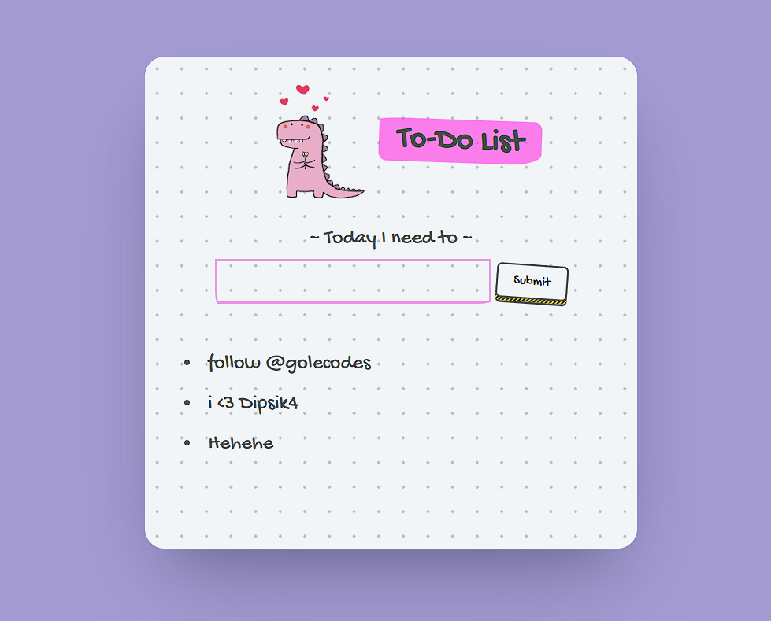

# 🦕 Todo List - A Cute & Functional Task Manager

A beautiful, interactive todo list application with a charming pink dinosaur theme. Built with vanilla HTML, CSS, and JavaScript, this project features a delightful user interface and smooth functionality for managing your daily tasks.



## ✨ Features

- **🎨 Beautiful UI**: Charming pink dinosaur theme with hand-drawn aesthetic
- **📝 Add Tasks**: Simple form to add new todo items
- **🗑️ Delete Tasks**: Click on any task to remove it
- **💾 Persistent Storage**: Tasks are saved in browser's localStorage
- **📱 Responsive Design**: Works perfectly on desktop and mobile devices
- **🎯 Clean Interface**: Minimalist design with playful elements

## 🚀 Live Demo

You can view the live demo of this project by opening `index.html` in your web browser.

## 🛠️ Technologies Used

- **HTML5**: Semantic structure and form elements
- **CSS3**: Modern styling with custom fonts and animations
- **JavaScript (ES6+)**: Interactive functionality and localStorage management
- **Google Fonts**: Gochi Hand font for the hand-drawn aesthetic

## 📁 Project Structure

```
TODO/
├── index.html          # Main HTML file
├── style.css           # CSS styling
├── script.js           # JavaScript functionality
├── pink_dino (2).png   # Cute dinosaur icon
├── images/
│   └── projectscreenshot.png  # Project screenshot
└── README.md           # This file
```

## 🎯 How to Use

1. **Adding Tasks**: Type your task in the input field and click "Submit"
2. **Completing Tasks**: Click on any task in the list to remove it
3. **Persistence**: Your tasks are automatically saved and will persist between browser sessions

## 🎨 Design Features

- **Color Scheme**: Soft purple background with pink accents
- **Typography**: Gochi Hand font for a playful, handwritten look
- **Animations**: Smooth hover effects and button interactions
- **Layout**: Centered card design with subtle grid pattern background
- **Icon**: Adorable pink dinosaur mascot with floating hearts

## 🔧 Setup Instructions

1. **Clone the repository**:
   ```bash
   git clone https://github.com/Manish-Tamang/Todo-List.git
   cd Todo-List
   ```

2. **Open in browser**:
   - Simply double-click on `index.html` to open in your default browser
   - Or drag and drop the file into any web browser

3. **Start using**:
   - Begin adding your tasks immediately
   - No additional setup required!

## 💡 Key Features Explained

### Local Storage
The app uses browser localStorage to persist your todo items, so they won't disappear when you refresh the page or close the browser.

### Responsive Design
The interface adapts beautifully to different screen sizes, from mobile phones to desktop computers.

### Interactive Elements
- Hover effects on todo items
- Smooth button animations
- Visual feedback for user interactions

## 🤝 Contributing

Feel free to contribute to this project by:
- Reporting bugs
- Suggesting new features
- Submitting pull requests

## 📝 License

This project is open source and available under the [MIT License](LICENSE).

## 👨‍💻 Author

**Manish Tamang**
- GitHub: [@Manish-Tamang](https://github.com/Manish-Tamang)

---

⭐ **Star this repository if you found it helpful!** 